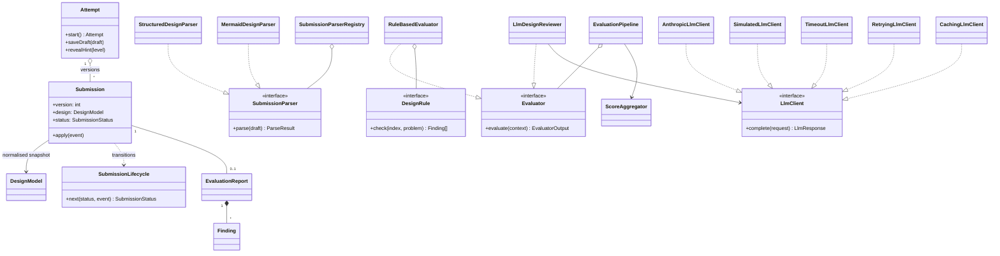

# Design note

## 1. MVP in one paragraph

A learner picks one of four problems (Parking Lot, Library Management, Vending
Machine, Elevator System), reads the brief, and builds a **structured design** in
a workspace. The design has classes and interfaces with responsibilities,
relationships, requirement traceability, patterns, trade-offs and an extension
answer, with a live class diagram. Work autosaves. On submit, the design is
snapshotted and **evaluated in the background**: 15 deterministic rules run first,
then an AI reviewer grounded on their findings. The learner watches progress, then
gets a report with a weighted rubric score, prioritised findings (each tagged
*Rule* or *AI*, linking into the editor), valid alternative approaches, and a
"since last version" summary. They revise and resubmit, and can compare any two
versions or see progress over time.

## 2. User flow

```
Problems ─▶ Problem brief ─▶ Workspace ──submit──▶ Evaluation progress ─▶ Feedback report
   ▲             │ (continue)   ▲   │ autosave              (poll)               │
   │             └──────────────┘   └── hints, versions, diagram, Mermaid import │
   └──────── Progress dashboard ◀── Compare versions ◀── "Revise design" ◀───────┘
```

## 3. Architecture

A simple monolith: one Node process serves the REST API, the built web app, and
an in-process evaluation worker. Layers follow a light hexagonal style: `domain`
has no framework imports, `application` holds the use cases, `infrastructure`
implements the ports, and `http` is a thin adapter.

```
apps/web  (React, TanStack Query)  ──REST──▶  apps/api
                                               ├─ http/        Fastify routes, error mapping
                                               ├─ application/ PracticeService, EvaluationService, ProgressService
                                               ├─ domain/      Attempt, Submission, SubmissionLifecycle, ports
                                               ├─ formats/     SubmissionParser registry (structured, mermaid)
                                               ├─ evaluation/  rules, LLM reviewer, pipeline, scoring, comparison
                                               ├─ worker/      EvaluationWorker (polls the durable queue)
                                               └─ infrastructure/ SQLite repos + job queue, problem catalogue
packages/shared   design IR, problem schema, DTOs, Mermaid parser/generator (used by both sides)
problems/*.json   problem catalogue: data, validated at startup
```

## 4. Core domain model



| Class / interface | Responsibility |
|---|---|
| `Attempt` | One learner on one problem. Owns the editable draft and the hints they revealed (progressive: hint N needs N-1). |
| `Submission` | Immutable snapshot of a design plus its status. Status changes only through `SubmissionLifecycle`. |
| `SubmissionLifecycle` | The state machine as one transition table: `submitted → evaluating → evaluated \| evaluated_partial \| failed`, with `requeue` and `retry`. Illegal moves throw. |
| `DesignModel` (shared) | The normalised design IR. **Every format parses into it, and every evaluator reads only it.** |
| `SubmissionParser` + registry | Strategy + Registry: one class per submission format. |
| `DesignIndex` | Precomputed read-only view (degrees, implementors, cycles, hierarchy depth) so each rule is a few lines. |
| `DesignRule` | One deterministic check → findings for one rubric criterion. 15 small classes. |
| `Evaluator` | Strategy for "anything that can judge a design". |
| `EvaluationPipeline` | Composite: deterministic evaluators (must succeed), then LLM evaluators (their failure degrades the report to *partial*), then scoring. |
| `LlmClient` + decorators | Port for text generation. Timeout, retry and caching are **Decorators**, so resilience policy lives in one place and is tested once. |
| `ScoreAggregator` | Combines rule evidence and AI judgement per criterion, weighted by the problem's rubric. |
| `JobQueue` / `EvaluationWorker` | Durable queue port (SQLite implementation) and the worker that drains it with backoff. |

## 5. Evaluation approach

**What the learner provides** (and why): responsibilities (to judge cohesion),
relationships (coupling, ownership), **traceability** (the checkable form of
"does the design meet the requirements"), patterns with a justification
(intent, not name-dropping), trade-offs (reasoning), and an **extension scenario**
answer (the interview's "what if" question, which tests extensibility directly).

**Deterministic rules (facts):** requirement coverage and concentration,
core-concept presence (synonym-aware, e.g. *Slot* ≈ *Spot*), design size, naming,
god classes, classes without responsibilities, empty interfaces, dangling
references, isolated classes, inheritance/ownership/usage cycles, hierarchy misuse
and depth, **abstraction at each declared point of change**, pattern
justification, extension answer specificity, and trade-off quality. Rules test
*properties*, never class names, which is how multiple valid designs are
accommodated.

**LLM reviewer (judgement):** gets the problem, the rubric, the learner's design,
and the **rule findings as trusted facts**. It returns strict JSON (structured
outputs), which is then validated with Zod. If the output is malformed it gets one
repair retry. Guardrails drop references to classes that don't exist and cap the
number of findings. The prompt tells it that many solutions are valid, and asks it
to describe *when* an alternative would be better.

**Scoring:** per criterion, `rule = 100 − deductions` (critical 45 / major 20 / minor 7).
With AI: `0.4·rule + 0.6·AI`. The AI may **lift at most +25** above the rule
evidence, and any **critical** rule finding caps the criterion at 50. The overall
score is weighted by the problem's rubric. Rules keep the AI honest, and the AI
covers what rules can't see.

**Comparison:** findings carry a stable fingerprint (rule id + evidence key), so
"fixed / still open / new" between versions is reliable for rule findings and
best-effort for AI findings.

## 6. When evaluation is slow or fails

- Submit returns immediately (`202`, status `submitted`). The client polls with
  the server-suggested interval and shows a stepper (checks → AI review → scoring).
- Jobs live in SQLite, so they survive restarts. Claiming is atomic. Jobs left by
  a crashed worker are released on boot and the submission is re-run.
- The LLM call has a timeout, and retries with exponential backoff only on
  retryable errors (timeouts, 429, 5xx). Auth and bad-request errors fail fast.
- **If the AI still fails, the learner still gets the rule-based report**
  (`evaluated_partial`), with a clear banner and a *Retry AI review* action.
- Unexpected errors retry the job up to 3 times, then the submission is marked
  `failed` with a retry button. The draft is never lost.
- The same content is never evaluated twice by accident: an unchanged resubmit
  returns `409 duplicate_submission`, and identical prompts hit the LLM cache.

## 7. Extensibility

- **New submission format** (e.g. a Java/TypeScript code skeleton): implement
  `SubmissionParser`, register it. Evaluators are untouched.
- **New evaluation approach** (e.g. a peer-review evaluator or static analysis of
  code): implement `Evaluator` and add it to the pipeline. New deterministic
  check: add a `DesignRule` class.
- **New problem:** add a JSON file. It is schema-validated at startup, and the
  rubric weights, synonyms, points of change and hints are data.
- **New LLM provider:** implement `LlmClient`. The decorators and reviewer
  are reused.
- **Scaling (light HLD):** the web tier only enqueues. Move `EvaluationWorker`
  to its own process against a shared queue (swap `SqliteJobQueue` for
  Postgres/SQS behind `JobQueue`), use Postgres behind the repositories, put a
  concurrency limit on LLM calls, and stream status over SSE instead of polling.

## 8. Key trade-offs

| Decision | Chosen | Cost / alternative |
|---|---|---|
| Submission format | Structured form (+ Mermaid) | More friction than free text, but it enables explainable checks and rehearses interview reasoning. Mermaid import softens the friction. |
| Scoring basis | Property rubric | Less "precise" than similarity to a reference, but fair to alternative designs. |
| AI role | Grounded, capped judge | Less creative than an unconstrained reviewer, but consistent and can't contradict facts. |
| Queue | SQLite table + in-process worker | Not horizontally scalable as is, but zero infrastructure. The interface allows a swap. |
| Storage | SQLite (Node built-in driver) | Single node, but no setup, and it's behind repositories. |
| Real-time updates | Polling with server hint | Slightly chattier than SSE, but trivial and robust through proxies. |
| Identity | Anonymous per-browser learner id | No cross-device history; auth is out of scope. Only one module and the server's learner resolution would change. |
| Offline AI | Simulated reviewer when no key is set | Heuristic quality only, so it is always labelled "AI (sim)" in the UI. |
