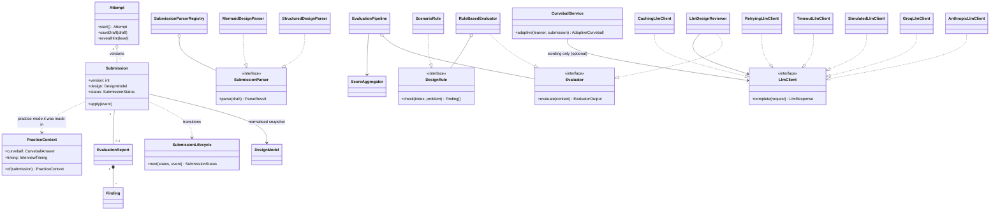

# Design note

## 1. MVP in one paragraph

A learner picks one of four problems (Parking Lot, Library Management, Vending
Machine, Elevator System), reads the brief, and **draws a design on a UML canvas**:
classes and interfaces with responsibilities and members, typed relationships,
requirements dropped onto the classes that own them, and optional **scenario
walkthroughs** (the ordered calls that carry out a requirement, checked against
the diagram). Written sections cover patterns, trade-offs and an extension
answer. Live checks run while drawing, and work autosaves. On submit, the design
is snapshotted and **evaluated in the background**: 16 deterministic rules run
first, then an AI reviewer grounded on their findings. The report gives a
weighted rubric score, prioritised findings (each tagged *Rule* or *AI*, linking
into the editor), the diagram annotated with them, and alternative approaches.
The learner then revises, or takes a **curveball**: a change request from the
problem's deck, or one aimed at the weakest point of change in their own design.
The next report measures its **blast radius** (which classes were added, changed
or left untouched). Every version is kept, for comparison and progress over time.

## 2. User flow

```
Problems ─▶ Brief ─▶ Workspace (canvas · walkthroughs · live checks) ──submit──▶ Evaluating (poll) ─▶ Report
   ▲  │                  ▲        ▲ autosave · undo · interview timer                                  │
   │  └ sample report ───┼────────┼────────────────────────────────────────────────────────────────▶  │
   │                     │        └──── take a curveball (deck or aimed at the design) ◀───────────────┤
   │                     └───────────── revise ◀───────────────────────────────────────────────────────┤
   └──── Progress (scores, criteria, achievements) ◀── Compare versions ◀──────────────────────────────┘
```

## 3. Architecture

A simple monolith: one Node process serves the REST API, the built web app, and
an in-process evaluation worker. Layers follow a light hexagonal style: `domain`
has no framework imports, `application` holds the use cases, `infrastructure`
implements the ports, and `http` is a thin adapter.

```
apps/web  (React, TanStack Query)  ──REST──▶  apps/api
                                               ├─ http/        Fastify routes, error mapping
                                               ├─ application/ PracticeService, EvaluationService, ProgressService,
                                               │               LintService, CurveballService, achievements
                                               ├─ domain/      Attempt, Submission, SubmissionLifecycle, PracticeContext, ports
                                               ├─ formats/     SubmissionParser registry (structured, mermaid)
                                               ├─ evaluation/  rules, LLM reviewer, pipeline, scoring, comparison
                                               ├─ worker/      EvaluationWorker (polls the durable queue)
                                               └─ infrastructure/ SQLite or Postgres repos + job queue, problem catalogue
packages/shared   design IR, problem schema, DTOs, Mermaid, scenario analysis, design diff (used by both sides)
problems/*.json   problem catalogue (and problems/samples/): data, validated at startup
```

## 4. Core domain model



| Class / interface | Responsibility |
|---|---|
| `Attempt` | One learner on one problem. Owns the editable draft and the hints they revealed (progressive: hint N needs N-1). |
| `Submission` | Immutable snapshot of a design plus its status. Status changes only through `SubmissionLifecycle`. |
| `SubmissionLifecycle` | The state machine as one transition table: `submitted → evaluating → evaluated \| evaluated_partial \| failed`, with `requeue` and `retry`. Illegal moves throw. |
| `DesignModel` (shared) | The normalised design IR. **Every format parses into it, and every evaluator reads only it.** |
| `SubmissionParser` + registry | Strategy + Registry: one class per submission format. |
| `DesignIndex` | Precomputed read-only view (degrees, implementors, cycles, hierarchy depth) so each rule is a few lines. |
| `DesignRule` | One deterministic check → findings for one rubric criterion. 16 small classes, including `ScenarioRule` for walkthroughs. |
| `Evaluator` | Strategy for "anything that can judge a design". |
| `EvaluationPipeline` | Composite: deterministic evaluators (must succeed), then LLM evaluators (their failure degrades the report to *partial*), then scoring. |
| `LlmClient` + decorators | Port for text generation. Timeout, retry and caching are **Decorators**, so resilience policy lives in one place and is tested once. |
| `ScoreAggregator` | Combines rule evidence and AI judgement per criterion, weighted by the problem's rubric. |
| `JobQueue` / `EvaluationWorker` | Durable queue port (SQLite implementation) and the worker that drains it with backoff. |
| `PracticeContext` | Value object: the practice mode a submission was made in (a curveball answered, interview timing). The single interpretation used by summaries and achievements. |
| `CurveballService` | Picks the point of change a design is least ready for (deterministic, same matching as the scoring rule) and turns it into a change request. A model only rewords it; a template is the fallback. |
| `diffDesigns` (shared) | Class-by-class change impact between two versions: added, modified (own code changed), untouched, plus the existing abstractions new classes plugged into. |

## 5. The five design questions, answered

| Question | Answer | Evidence |
|---|---|---|
| What must a learner provide for an attempt to be meaningful? | Classes with responsibilities, typed relationships, requirement → class ownership, patterns *with a reason*, trade-offs, and an extension answer. Optionally, walkthroughs of key requirements. Each item is there because a rule or the reviewer checks it (see §6). | `packages/shared/src/design.ts`, `evaluation/rules/*` |
| What makes feedback useful when many solutions are valid? | Scoring **properties** (is every requirement owned? is each point of change behind an abstraction?) instead of similarity to a reference answer. Findings name the learner's own classes, say whether a rule or the AI raised them, and suggest *when* an alternative is better. | `apps/api/test/unit/fairness.test.ts`: a strategy-and-inheritance design and an enum-based design with different names for every seam score 100 and 100 on the rules (90 and 88 with the offline reviewer). A god-class design scores 52 (42). |
| Which parts are deterministic, and which need an LLM? | **Deterministic:** facts (coverage, cycles, dangling references, abstraction at a point of change, walkthrough validity, change impact, curveball targeting). **LLM:** judgement (cohesion, naming quality, alternatives, curveball wording), grounded on the facts, schema-validated, and capped (+25 above the evidence, 50 under a critical finding). | `evaluation/score-aggregator.ts`, `llm-reviewer.ts`, `curveball-service.ts` |
| How would another evaluation approach or submission format fit? | A new format is a `SubmissionParser` into the one design model. A new evaluator is an `Evaluator` in the pipeline, a new check is a `DesignRule`, and a new model provider is an `LlmClient`. Two formats (structured, Mermaid) and three providers (Claude, Groq, simulator) already use these seams. | §8 |
| What if evaluation is slow or fails? | Submit returns 202 at once, and the job lives in a durable queue. The AI call has a timeout, retries and a cache. If the AI still fails, the learner gets a rules-only report and can retry the AI review. | §7, integration tests "AI outage → partial report → retry", "crash → failed", "abandoned job recovery" |

## 6. Evaluation approach

**What the learner provides** (and why): responsibilities (to judge cohesion),
relationships (coupling, ownership), **traceability** (the checkable form of
"does the design meet the requirements"), patterns with a justification
(intent, not name-dropping), trade-offs (reasoning), and an **extension scenario**
answer (the interview's "what if" question, which tests extensibility directly).
Optionally, **scenario walkthroughs**: for a requirement, the ordered calls
between classes that carry it out (a sequence diagram). This makes collaboration
checkable, because a class can only call a class it holds a relationship to.

**Deterministic rules (facts):** requirement coverage and concentration,
core-concept presence (synonym-aware, e.g. *Slot* ≈ *Spot*), design size, naming,
god classes, classes without responsibilities, empty interfaces, dangling
references, isolated classes, inheritance/ownership/usage cycles, hierarchy misuse
and depth, **abstraction at each declared point of change**, pattern
justification, extension answer specificity, trade-off quality, and **scenario
walkthroughs** (every call must follow a drawn relationship, possibly through an
interface; the message must be a method the callee declares; the chain must not
jump to a class nobody called). The walkthrough analysis lives in
`packages/shared` so the canvas (live) and the server (scoring) agree. Rules test
*properties*, never class names, which is how multiple valid designs are
accommodated.

**LLM reviewer (judgement):** gets the problem, the rubric, the learner's design,
and the **rule findings as trusted facts**. It returns strict JSON (structured
outputs), which is then validated with Zod. If the output is malformed it gets one
repair retry. Guardrails drop references to classes that don't exist and cap the
number of findings. The prompt tells it that many solutions are valid, and asks it
to describe *when* an alternative would be better.

**Scoring:** per criterion, `rule = 100 − deductions` (critical 45 / major 20 / minor 7).
With AI: `0.4·rule + 0.6·AI`. The AI may **lift at most +25** above the rule
evidence, and any **critical** rule finding caps the criterion at 50. The overall
score is weighted by the problem's rubric. Rules keep the AI honest, and the AI
covers what rules can't see.

**Change impact (curveball):** `diffDesigns` (in `packages/shared`) compares two
versions class by class. It matches classes by id, so renames are followed, and
falls back to matching by name. A class counts as *modified* only when its own
code would change: kind, name, members, responsibilities, or the relationships
it holds (outgoing). A new class that implements an existing interface therefore
leaves the interface untouched. The verdict is *extended* (nothing existing
changed), *contained* (one or two classes, usually the wiring point) or *rippled*.
This is the practical test of the open/closed principle, and it is deterministic,
so it is shown as a measurement rather than scored.

**Comparison:** findings carry a stable fingerprint (rule id + evidence key), so
"fixed / still open / new" between versions is reliable for rule findings and
best-effort for AI findings.

## 7. When evaluation is slow or fails

- Submit returns immediately (`202`, status `submitted`). The client polls with
  the server-suggested interval and shows a stepper (checks → AI review → scoring).
- Jobs live in SQLite, so they survive restarts. Claiming is atomic. Jobs left by
  a crashed worker are released on boot and the submission is re-run.
- The LLM call has a timeout, and retries with exponential backoff only on
  retryable errors (timeouts, 429, 5xx). Auth and bad-request errors fail fast.
- **If the AI still fails, the learner still gets the rule-based report**
  (`evaluated_partial`), with a clear banner and a *Retry AI review* action.
- Unexpected errors retry the job up to 3 times, then the submission is marked
  `failed` with a retry button. The draft is never lost.
- The same content is never evaluated twice by accident: an unchanged resubmit
  returns `409 duplicate_submission`, and identical prompts hit the LLM cache.

## 8. Extensibility

- **New submission format** (e.g. a Java/TypeScript code skeleton): implement
  `SubmissionParser`, register it. Evaluators are untouched.
- **New evaluation approach** (e.g. a peer-review evaluator or static analysis of
  code): implement `Evaluator` and add it to the pipeline. New deterministic
  check: add a `DesignRule` class.
- **New problem:** add a JSON file. It is schema-validated at startup, and the
  rubric weights, synonyms, points of change and hints are data.
- **New LLM provider:** implement `LlmClient`. The decorators and reviewer
  are reused, as Groq was added without touching the reviewer.
- **New practice mode:** interpret it in `PracticeContext`, so summaries and
  achievements pick it up in one place.
- **Scaling (light HLD):** the web tier only enqueues. Move `EvaluationWorker`
  to its own process against a shared queue (swap `SqliteJobQueue` for
  Postgres/SQS behind `JobQueue`), use Postgres behind the repositories, put a
  concurrency limit on LLM calls, and stream status over SSE instead of polling.

## 9. Key trade-offs

| Decision | Chosen | Cost / alternative |
|---|---|---|
| Submission format | Structured form (+ Mermaid) | More friction than free text, but it enables explainable checks and rehearses interview reasoning. Mermaid import softens the friction. |
| Scoring basis | Property rubric | Less "precise" than similarity to a reference, but fair to alternative designs. |
| AI role | Grounded, capped judge | Less creative than an unconstrained reviewer, but consistent and can't contradict facts. |
| Queue | SQLite table + in-process worker | Not horizontally scalable as is, but zero infrastructure. The interface allows a swap. |
| Storage | SQLite (Node built-in driver) by default; Postgres when `DATABASE_URL` is set | SQLite needs no setup. Postgres (e.g. free Supabase) is for hosts without a persistent disk. Both implement the same repository and queue ports, and the HTTP suite runs on each. |
| Real-time updates | Polling with server hint | Slightly chattier than SSE, but trivial and robust through proxies. |
| Identity | Anonymous per-browser learner id | No cross-device history; auth is out of scope. Only one module and the server's learner resolution would change. |
| Offline AI | Simulated reviewer when no key is set | Heuristic quality only, so it is always labelled "AI (sim)" in the UI. |
| Canvas vs. form | A UML canvas is the primary editor; the forms stay as tabs | More front-end code, but learners draw designs in interviews, and the canvas makes relationships and walkthroughs visible. |
| Change impact | Measured and shown, not scored | A strong signal of open/closed design, but legitimate refactors also "change" classes, so penalising them would be unfair. |
